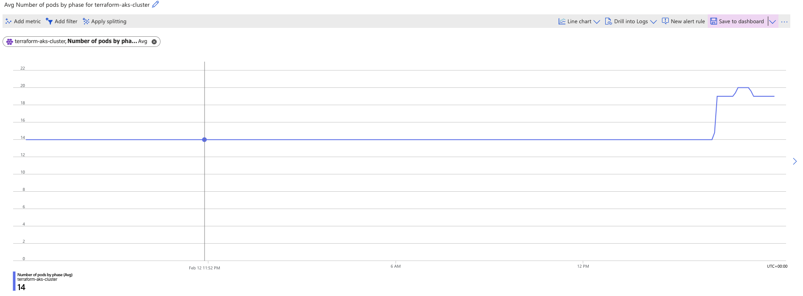
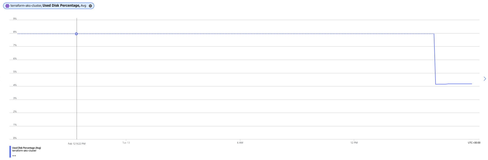
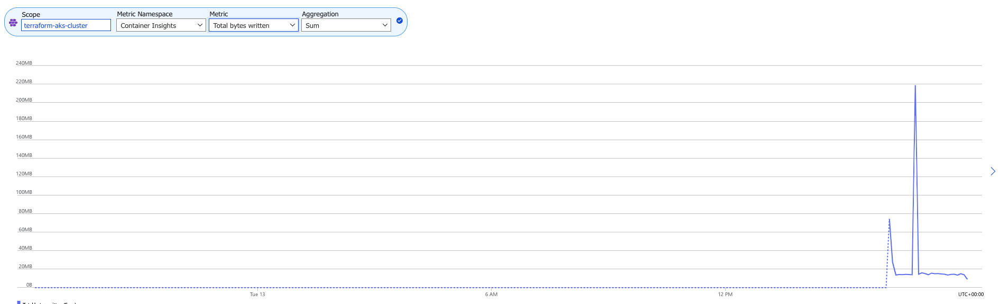

# Web-App-DevOps-Project

Welcome to the Web App DevOps Project repo! This application allows you to efficiently manage and track orders for a potential business. It provides an intuitive user interface for viewing existing orders and adding new ones.

## Table of Contents

- [Features](#features)
- [Getting Started](#getting-started)
- [Technology Stack](#technology-stack)
- [Contributors](#contributors)
- [License](#license)

## Features

- **Order List:** View a comprehensive list of orders including details like date UUID, user ID, card number, store code, product code, product quantity, order date, and shipping date.


- **Pagination:** Easily navigate through multiple pages of orders using the built-in pagination feature.


- **Add New Order:** Fill out a user-friendly form to add new orders to the system with necessary information.


- **Data Validation:** Ensure data accuracy and completeness with required fields, date restrictions, and card number validation.

## Getting Started

### Prerequisites

For the application to succesfully run, you need to install the following packages:

- flask (version 2.2.2)
- pyodbc (version 4.0.39)
- SQLAlchemy (version 2.0.21)
- werkzeug (version 2.2.3)

### Usage

To run the application, you simply need to run the `app.py` script in this repository. Once the application starts you should be able to access it locally at `http://127.0.0.1:5000`. Here you will be meet with the following two pages:

1. **Order List Page:** Navigate to the "Order List" page to view all existing orders. Use the pagination controls to navigate between pages.

2. **Add New Order Page:** Click on the "Add New Order" tab to access the order form. Complete all required fields and ensure that your entries meet the specified criteria.

## Technology Stack

- **Backend:** Flask is used to build the backend of the application, handling routing, data processing, and interactions with the database.

- **Frontend:** The user interface is designed using HTML, CSS, and JavaScript to ensure a smooth and intuitive user experience.

- **Database:** The application employs an Azure SQL Database as its database system to store order-related data.

## Contributors

- [Maya Iuga](<[https://github.com/yourusername](https://github.com/maya-a-iuga)>)

## License

This project is licensed under the MIT License. For more details, refer to the [LICENSE](LICENSE) file.

## Robin Winters Azure End-to-End DevOps Pipeline Project

1. _delivery-date column:_ delivery_date added to both backend (app.py) and frontend (order.html) files.
2. _removed delivery-date column:_ delivery_date removed from both backend (app.py) and frontend (order.html) files.

### Containerization

1. Dockerfile created based on python:3.8-slim
2. Docker image builded.
   **imagename:** web-app-image
   **imagetag:** 1.0
3. Image pushed to Docker Hub

- Image can be seen from the link below
- https://hub.docker.com/repository/docker/robinwinters/web-app-image/general

### Networking Services Deployment with Terraform

#### Overview

This repository contains Terraform configurations for deploying networking resources in Azure, including a Virtual Network (VNet), subnets, and Network Security Groups (NSGs). This README provides an overview of the networking services deployed using Infrastructure as Code (IaC) with Terraform.

#### Prerequisites

Before running the Terraform configurations, ensure you have the following prerequisites set up:

Azure subscription
Azure CLI installed and configured
Terraform CLI installed

#### Terraform Configuration

1. Input Variables

   - resource_group_name: The name of the Azure resource group where networking resources will be created.
   - location: The Azure region where networking resources will be deployed.
   - vnet_address_space: The address space for the Virtual Network (VNet).

2. Networking Resources

   - Azure Resource Group
   - Virtual Network (VNet)
   - Subnets
   - Network Security Group (NSG)

3. Output Variables
   - vnet_id: ID of the Virtual Network (VNet).
   - control_plane_subnet_id: ID of the control plane subnet.
   - worker_node_subnet_id: ID of the worker node subnet.
   - resource_group_name: Name of the Azure Resource Group for networking resources.
   - aks_nsg_id: ID of the Network Security Group (NSG) for AKS.

#### Usage

1. Clone Repository: Clone this repository to your local machine.
2. Set Terraform Variables: Update the variables.tf file with your desired values for input variables.
3. Initialize Terraform: Run terraform init to initialize the Terraform configuration.
4. Review Execution Plan: Run terraform plan to review the execution plan and ensure it matches your expectations.
5. Apply Terraform Changes: Run terraform apply to apply the Terraform changes and deploy networking resources to Azure.

- \*\*git can only support files of a certain size & that the .terraform is larger so has to be avoided

### AKS Cluster steps with Terraform

1. Clone the repository

```
git clone https://github.com/robinucar/Web-App-DevOps-Project.git
cd Web-App-Devops-Project
cd aks-terraform
cd aks-cluster-module

```

2. Define Input Variables:

   - aks_cluster_name: The name of the AKS cluster.
   - cluster_location: The Azure region where the AKS cluster will be created.
   - dns_prefix: DNS prefix for the AKS cluster.
   - kubernetes_version: The version of Kubernetes to be used.
   - service_principal_client_id: Client ID of the service principal used for authentication.
   - service_principal_client_secret: Client Secret associated with the service principal.
   - resource_group_name: Name of the Azure Resource Group for networking resources.
   - vnet_id: ID of the Virtual Network (VNet).
   - control_plane_subnet_id: ID of the control plane subnet.
   - worker_node_subnet_id: ID of the worker node subnet.

3. Define AKS Cluster Configuration:

   - Update the main.tf file to define the AKS cluster configuration using the azurerm_kubernetes_cluster resource block. Specify the desired configuration options such as name, location, DNS prefix, Kubernetes version, and service principal details.

4. Define Output Variables:
   Update the output.tf file to define output variables for the AKS cluster. The output variables include:

   - aks_cluster_name: Name of the AKS cluster.
   - aks_cluster_id: ID of the AKS cluster.
   - aks_kubeconfig: Kubeconfig file for accessing the AKS cluster.

5. Initialize Terraform:

   - Run the following command to initialize Terraform and download the required provider plugins:

   ```
   terraform init

   ```

### WEB-APP-DEVOPS-PROJECT Terraform Azure Aks Cluster Deployment

This project automates the deployment of an Azure Kubernetes Service (AKS) cluster using Terraform. It sets up networking resources and provisions an AKS cluster on Microsoft Azure.

#### Prerequisites

Before you begin, make sure you have the following prerequisites installed:

- [Terraform](https://www.terraform.io/downloads.html)
- [Azure CLI](https://docs.microsoft.com/en-us/cli/azure/install-azure-cli)

You also need an Azure subscription and Service Principal credentials to authenticate with Azure.

## Project Structure

The project structure is organized as follows:

- `main.tf`: The main Terraform configuration file that orchestrates the deployment of resources.
- `variables.tf`: Defines input variables used in the main configuration file.
- `networking-module/`: Directory containing the Terraform module for networking resources.
- `aks-cluster-module/`: Directory containing the Terraform module for AKS cluster provisioning.
- `output.tf`: Defines output variables to retrieve information after deployment.

## Configuration

### Provider Setup

The `main.tf` file configures the `azurerm` provider to interact with Azure APIs. Replace `var.client_id` and `var.client_secret` with your Azure Service Principal credentials.

```hcl
provider "azurerm" {
  features {}

  client_id       = var.client_id
  client_secret   = var.client_secret
  subscription_id = "<subscription_id>"
  tenant_id       = "<tenant_id>"
}


```

### WEB-APP-DEVOPS-PROJECT Kubernetes Deployment

This repository contains detailed documentation for the deployment of a containerized web application onto an Azure Kubernetes Service (AKS) cluster using Kubernetes manifests. Below, we outline the key stages of the deployment process and provide insights into the configuration settings, deployment strategy, testing, validation, and distribution plan for the application.

#### Deployment and Service Manifests

1. Deployment Manifest:
   - The Deployment manifest (application-manifest.yaml) defines a Kubernetes Deployment named flask-app-deployment for the containerized web application.
   - Key concepts and configuration settings include:
     - Specifying two replicas for scalability and high availability.
     - Using labels (e.g., app: flask-app) to match pods and ensure efficient traffic routing.
     - Configuring the container image (robinwinters/web-app-image:1.0) and exposing port 5000 for communication.
     - Implementing a RollingUpdate deployment strategy to ensure seamless application updates.
2. Service Manifest:
   - The Service manifest within the same file defines a Kubernetes Service named flask-app-service to facilitate internal communication within the AKS cluster.
   - Key configuration settings include:
     - Matching the selector with the labels of the Deployment pods.
     - Using the ClusterIP type and TCP protocol on port 80 to communicate with the pods.
     - Setting the targetPort to 5000 to access the application's user interface.

#### Deployment Strategy

The chosen deployment strategy is RollingUpdate. This strategy was selected for its ability to update the application with zero downtime by gradually replacing old pods with new ones. It aligns with the application's requirements for continuous availability and reliability, ensuring seamless updates without impacting user experience.

### CI/CD Pipeline Documentation

This section provides comprehensive information about the CI/CD pipeline configured in Azure DevOps for this project.

#### Configuration and Settings

- Source Repository:
  The source code for this project is hosted on GitHub. The repository contains the application code along with the necessary configuration files for the CI/CD pipeline.

- Build Pipeline (Starter Pipeline):
  The CI/CD pipeline is configured using the Starter Pipeline template provided by Azure DevOps. This simple pipeline is a foundation for further customization and includes basic build and test stages. It automatically triggers on each push to the main branch of the GitHub repository.

- Integration with Docker Hub:
  The CI/CD pipeline is integrated with Docker Hub for container image management. A Docker service connection is configured in Azure DevOps to facilitate seamless integration with Docker Hub's container registry. To integrate the CI/CD pipeline with Docker Hub, follow these steps:

  1. Create Docker Hub Personal Access Token:

     - Generate a Personal Access Token (PAT) in Docker Hub with the necessary permissions to push Docker images.

  2. Create Docker Service Connection in Azure DevOps

     - Navigate to Project Settings > Service connections in Azure DevOps.
     - Click on "New service connection" and choose "Docker Registry".
     - Enter your Docker Hub credentials and the Personal Access Token created earlier.

  3. Update Pipeline YAML:
     - Add tasks to your pipeline YAML file to build and push Docker images to Docker Hub as part of the build process.

- Integration with AKS:
  While the Starter Pipeline does not include specific deployment steps to AKS, it can be extended to incorporate deployment tasks using Azure Kubernetes Service (AKS) in subsequent iterations. To integrate the CI/CD pipeline with Azure Kubernetes Service (AKS), follow these steps:

  1. Create AKS Service Connection in Azure DevOps

     - Navigate to Project Settings > Service connections in Azure DevOps.
     - Click on "New service connection" and choose "Kubernetes".
     - Provide the necessary details such as AKS cluster name, resource group, and authentication method.

  2. Update Pipeline YAML:

     - Add tasks to your pipeline YAML file to deploy the application to AKS using kubectl commands or Azure DevOps deployment tasks.

- Validation Steps:

  Since the Starter Pipeline focuses on basic build and test stages, the validation steps primarily involve testing the functionality of the application locally and ensuring that the build process completes successfully.

- Testing Functionality:

  - Local Testing: Before pushing changes to the main branch, local testing is performed to ensure that the application functions as expected.

  - Build Verification: Upon triggering the CI/CD pipeline, the build process verifies that the application code compiles successfully and any automated tests included in the pipeline pass.

### Monitoring Strategy for AKS Cluster

This section outlines the comprehensive monitoring strategy implemented for the Azure Kubernetes Service (AKS) cluster used in this project.

#### Metrics Explorer Charts

1. Average Node CPU and Memory Usage

- Tracks CPU and memory usage to optimize resource allocation.
  

2. Pods Counts with Phase

- Monitors pod lifecycle management and workload distribution.
  

3. Average Used Disk Percentage

- Tracks disk usage to prevent storage-related issues.
  

4. Sum of Total Bytes Read and Written per Minute

- Monitors data I/O for identifying performance bottlenecks.

  
  

#### Log Analytics Logs

- Node CPU and memory usage, pod counts, disk usage, data I/O, container logs, and Kubernetes events are analyzed through Log Analytics.

#### Alarm Configurations

- Threshold alarms set for CPU and memory usage, disk usage, data I/O, container logs, and Kubernetes events.
